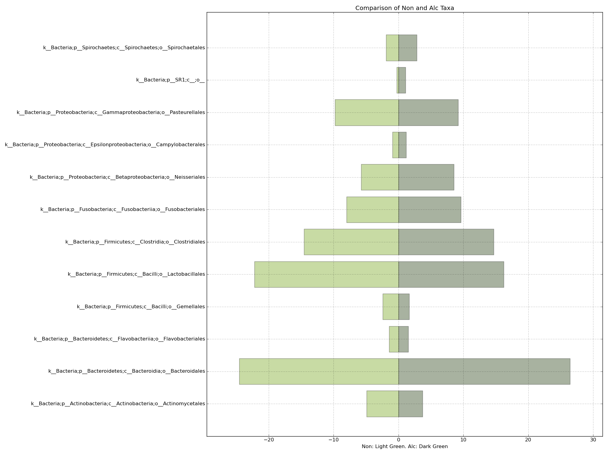

# Totem Plots
## The future is amazing!

```
./totem.py -h
usage: totem.py [-h] -i INPUT -o OUTPUT [-c CORE CORE] [-l LEVEL] [-p PERCENT]
                [-s]

optional arguments:
  -h, --help            show this help message and exit
  -i INPUT, --input INPUT
                        The input biom to totemize. MUST BE A TXT
  -o OUTPUT, --output OUTPUT
                        The output file
  -c CORE CORE, --core CORE CORE
                        The core OTUs to subset to. i.e. core_otus_100.txt
  -l LEVEL, --level LEVEL
                        The taxa level to plot. Required if core is supplied.
  -p PERCENT, --percent PERCENT
                        The minimum percent present to make it to the plot
```
